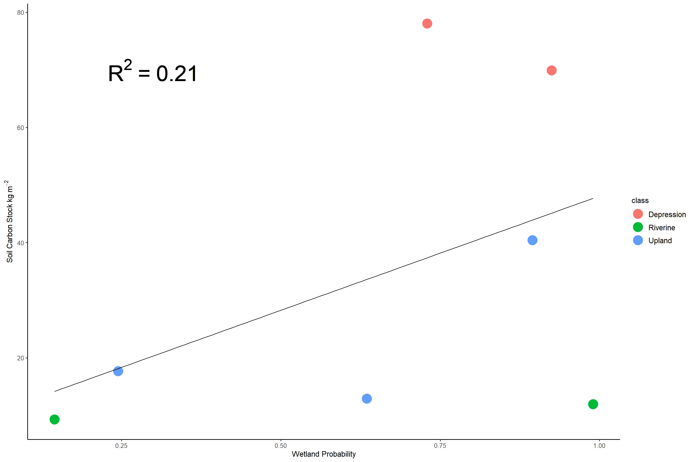

# Evaluation and Scaling of Soil Carbon in the Hoh River Watershed
### Author: Anthony Stewart

## Introduction:
Wetlands disproportionately contribute to the overall terrestrial carbon pool by storing as much as 20-30% of global soil carbon despite occupying only 5-8% of the land surface area. However, uncertainty still surrounds identifying wetlands under forest canopy cover referred to as forested wetlands. Our recent research endeavor has developed a remote sensing driven approach to identify and assess carbon stocks in forested wetlands. This approach uses fine scale topographic metrics that distribute landscape water flow and identify areas of accumulation and soil saturation for wetland formation. This produces maps of wetland probability and allows us to sample across the upland-to-wetland continuum to measure carbon stocks. 
* Project Objective: Using preliminary observations of soil carbon, can I scale up to a watershed wide soil carbon stock estimate using the input raster layers and model output

## Approach
This approach utilizes raster data layers and soil carbon point data to provide an estimate of soil carbon across the Hoh River watershed area in Washington State. The raster layers are derived from a wetland identification model and soil carbon data were measured at 7 locations in September 2020.

### Datasets
* SRTM 1 Arc-Second GeoTiffs downloaded from USGS EarthExplorer
    * These DEMs will be used to calculate topography metrics 
### Metrics
* Slope
* Plan Curvature
* Upslope Contributing Area
* Topographic Wetness Index

These metrics also go into a wetland probability model. The output of this model is a probability raster and I will be taking these metrics and the wetland probability to create a raster stack to merge with the soil carbon point data. Point locations will be used to extract raster data for a regression to predict soil carbon and then used to model across the Hoh River Watershed.

### Analysis Python Packages
* Numpy
* Pandas
* Matplotlib
* GDAL
* Geopandas
* Rasterstats
* Rasterio

## Expected Outcomes
I expect to produce a statistical relationship between topographic metrics and soil carbon then a map model of soil carbon across the Hoh Watershed

